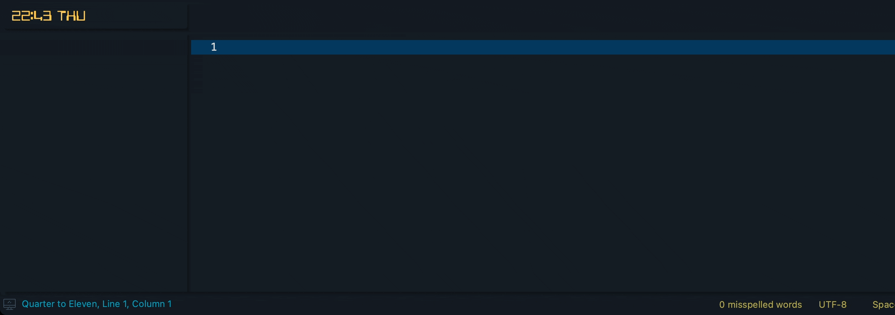
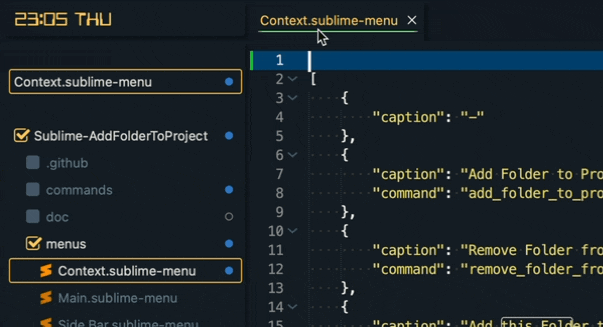

# AddFolderToProject

**AddFolderToProject** is a Sublime Text package that streamlines the process of adding and removing folders to and from your projects. It provides a set of commands and context menu options to manage your project's folder structure directly from the editor.

```markdown
    Of course, you can use the already built-in function (Project -> Add Folder to Project...).
    But then you have to click through all the folders again and again.
```

| Repository | GitHub | Sublime / Package Control |
| ------ | ------ | ------ |
|  |   |  |
|  |   |  |
|   |  |  |
|   |  |  |

| Status |
| ------ |
| [](https://github.com/dennykorsukewitz/Sublime-AddFolderToProject/compare/1.0.0...dev)   |

## Feature

- [Add Folder to Project](#add-folder-to-project)
- [Remove Folder from Project](#remove-folder-from-project)
- [Add Custom Folder to Project](#add-custom-folder-to-project)
- [Add this Folder to Project](#add-this-folder-to-project)
- [Remove this Folder from Project](#remove-this-folder-from-project)
- [Create Project from File](#create-project-from-file)
- [Copy File Path](#copy-file-path)
- [Copy Dir Path](#copy-dir-path)

### Add Folder to Project

This function provides a searchable list of folders that can be added to the current project.

The list consists of absolute paths (see [Settings](#settings)) `add_folder_to_project_folders` and recursive paths `add_folder_to_project_recursive_folders`.

**Command:**  ```AddFolderToProject: Add Folder to Project```


### Remove Folder from Project

This function provides a list of active folders in the project, that can be removed from the current project.

**Command:**  ```AddFolderToProject: Remove Folder from Project```


### Add Custom Folder to Project

This function allows you to add a custom folder to the project (absolute path).

**Command:**  ```AddFolderToProject: Add Custom Folder to Project```



### Add this Folder to Project

This function adds the folder of the current open file to the project.

**Command:**  ```AddFolderToProject: Add this Folder to Project```


### Remove this Folder from Project

This function removes the folder of the current open file from the project.

**Command:**  ```AddFolderToProject: Remove this Folder from Project```


### Create Project from File

This function creates a new project (new sublime window) with the folder of the current open file.

**Command:**  ```AddFolderToProject: Create Project from File```


### Copy File Path

Copies the file path of the current open file.

**Command:**  ```AddFolderToProject: Copy File Path```


### Copy Dir Path

Copies the dir path of the current open file.

**Command:**  ```AddFolderToProject: Copy Dir Path```


### General

#### Save Folder In Settings

Each time a folder is added, the code checks whether it already exists in the configuration (`add_folder_to_project_folders`).
If not, it asks whether this path should be saved.

---

## Menus

These functions are accessible through the context menu and the sidebar menu, making it easy to manage your project's folders without leaving your editor.

### Context Menu

The following functions are available in the Context menu:

- [Add Folder to Project](#add-folder-to-project)
- [Remove Folder from Project](#remove-folder-from-project)
- [Add this Folder to Project](#add-this-folder-to-project)
- [Remove this Folder from Project](#remove-this-folder-from-project)
- [Create Project from File](#create-project-from-file)
- [Copy File Path](#copy-file-path)
- [Copy Dir Path](#copy-dir-path)




### Sidebar Menu

The following functions are available in the Sidebar menu:

- [Add Folder to Project](#add-folder-to-project)
- [Remove Folder from Project](#remove-folder-from-project)
- [Add this Folder to Project](#add-this-folder-to-project)
- [Remove this Folder from Project](#remove-this-folder-from-project)
- [Create Project from File](#create-project-from-file)
- [Copy File Path](#copy-file-path)
- [Copy Dir Path](#copy-dir-path)


## Settings

`Settings -> Package Settings -> AddFolderToProject -> Settings`

| Name | Description | Default Value |
| - | - | - |
| add_folder_to_project_folders | Provides a searchable list of folders that can be added to the current project. | `/Users/dennykorsukewitz/` |
| add_folder_to_project_recursive_folders | Provides a searchable (only first level) list of folders (recursive) that can be added to the current project. For example: "/Users/" - adds "/Users/dennykorsukewitz/" to list. | `` |

---

## Installation

To install this package, you have **three** options:

### 1. Search Package via `Package Control`

Search and install online package via [Sublime Package Control](http://wbond.net/sublime_packages/package_control).

`Tools` -> `Command Palette` -> `Package Control: Install Package` -> simply search for `AddFolderToProject` to install.

### 2. Install via sublime-package file

Download latest [sublime-package file](https://github.com/dennykorsukewitz/Sublime-AddFolderToProject/releases) and move the package `AddFolderToProject.sublime-package` to `Installed Packages` folder.

#### OSX

```bash
cd ~/Library/Application\ Support/Sublime\ Text\ 2/Installed Packages/
- or ST 3 -
cd ~/Library/Application\ Support/Sublime\ Text\ 3/Installed Packages/
```

#### Linux

```bash
cd ~/.config/sublime-text-2/Installed Packages
- or ST 3 -
cd ~/.config/sublime-text-3/Installed Packages
```

#### Windows

```bash
cd "%APPDATA%\Sublime Text 2\Installed Packages"
- or ST 3 -
cd "%APPDATA%\Sublime Text 3\Installed Packages"
```

### 3. Source code

Clone the latest [dev branch](https://github.com/dennykorsukewitz/Sublime-AddFolderToWorkspace) and unpack it to Sublime Package folder `Packages`.

#### OSX

```bash
cd ~/Library/Application\ Support/Sublime\ Text\ 2/Packages/
- or ST 3 -
cd ~/Library/Application\ Support/Sublime\ Text\ 3/Packages/
git clone git@github.com:dennykorsukewitz/Sublime-AddFolderToWorkspace.git AddFolderToProject
```

#### Linux

```bash
cd ~/.config/sublime-text-2/Packages
- or ST 3 -
cd ~/.config/sublime-text-3/Packages
git clone git@github.com:dennykorsukewitz/Sublime-AddFolderToWorkspace.git AddFolderToProject
```

#### Windows

```bash
cd "%APPDATA%\Sublime Text 2\Packages"
- or ST 3 -
cd "%APPDATA%\Sublime Text 3\Packages"
git clone git@github.com:dennykorsukewitz/Sublime-AddFolderToWorkspace.git AddFolderToProject
```

---

## Download

For download see [Sublime-AddFolderToProject](https://github.com/dennykorsukewitz/Sublime-AddFolderToProject/releases)

---

Enjoy!

Your [Denny Korsukéwitz](https://github.com/dennykorsukewitz) 🚀
